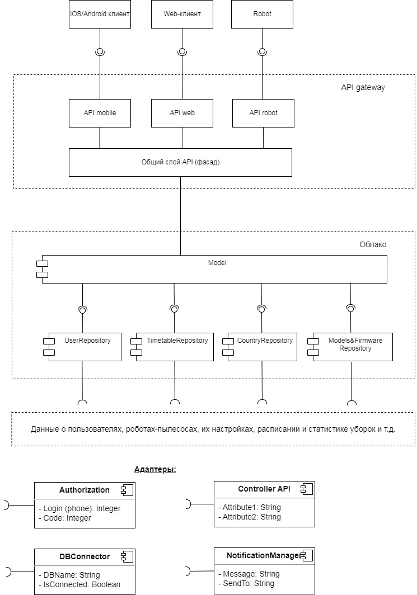

# `Домашнее задание 10`

## `Задача:`

Необходимо спроектировать облачный сервис домашнего робота пылесоса для уборки помещений.
Результатом должны быть: компоненты интерфейсов, доменная модель, Use-case, компонентные диаграммы, ERD, API-контракты, тестовые сценарии.

1. Спроектировать пользовательский интерфейс (web-SPA, native mobile), основные компоненты (подключение робота, управление помещениями, расписание работы, сервисное обслуживание робота, история уборок), https://www.figma.com/ или https://app.diagrams.net/.

2. Спроектировать доменную модель, в виде текста Домен – атрибуты.

3. Спроектировать сценарии (Use case)(подключение, выбор помещения, программы уборки, настройка расписания, просмотр статистики..), в виде Актор – Прецедент (из первой лекции).

4. Спроектировать слой API Gateway (mobile, web), сформировать REST запросы: GET, POST, PUT, DELETE (https://swagger.io).
** (необязательно) Разработать REST контракты API между компонентами и сгенерировавать (автоматически на ресурсе https://swagger.io) код на разных языках программирования.

5. Спроектировать компоненты бизнес-логики и связать их API Gateway с применением паттерна BFF https://app.diagrams.net/.

6. Определить состав информации для кеширования на уровне приложения пользователя, API Gateway, уровня бизнес-логики и уровня репозитория. Список.

7. Спроектировать ERD модель (https://www.dbdesigner.net/), запросы в БД и уровень хранения данных (СУБД).

## `Описание решения:`

1. Экранные формы пользовательского интерфейса (web-SPA, native mobile), основные компоненты (подключение робота, управление помещениями, расписание работы, сервисное обслуживание робота, история уборок) разработаны в Figma и представлены по ссылке:

https://www.figma.com/file/ONqDMp59OIQSqSb77ZCUAW/CloudServiceRobotCleaner?node-id=0%3A1&t=qqaDIhX800FIWYp8-1

2. Доменная модель включает в себя следующие сущности и их атрибуты:
  * Пользователи (имя, страна, город, телефон, email, серийные номера роботов-пылесосов пользователя)
  * Перечень стран и городов
  * Роботы-пылесосы (серийный номер изделия, модель, настройки конфигурации, версия прошивки, диагностические данные, статистика уборок)
  * Расписание уборки (дата и время, комната, режим уборки) 
  * Перечень комнат (наименование, площадь)
  * Режимы уборки (наименование режима)
  * Таблица кодов результата уборки роботом (код, расшифровка-описание результата или ошибки)
  * История уборок (дата и время, комната, режим уборки, код результата уборки)

3. Use-case диаграмма, описывающая сценарии подключения, выбора помещения, программы уборки, настройку расписания, просмотр статистики в виде Актор – Прецедент, представлена ниже:

4. Слой API Gateway и REST запросы: GET, POST, PUT, DELETE (https://swagger.io).
** (необязательно) Разработать REST контракты API между компонентами и сгенерировавать (автоматически на ресурсе https://swagger.io) код на разных языках программирования.

5. UML-диаграмма компонентов бизнес-логики представлена на ниже:

6. Состав информации для кеширования:

* на уровне приложения пользователя: медиа-контент, библиотеки JavaScript, таблицы стилей, изображения, логотипы, иконки, пара логин-пароль (чтобы пользователю не приходилось каждый раз при запуске приложения авторизовываться в системе).

* на уровне API Gateway: пары объектов Request и Response, представляющих HTTP-запросы и ответы соответственно (например, запрос реестра всех служб, участвующих в работе приложения, и их адреса в теле ответа)

* на уровне бизнес-логики: экземпляры классов бизнес-компонентов, которые берут данные из базы данных и в дальнейшем операции с данными осущствляются на уровке кэша, а такж состояние данных эксземпляров (недавно создан, не изменен, удален и т.д.). После того, как пользователь завершит работу с приложением или нажмет кнопку сохранить, данные записываются из кэша в базу данных, а кэш удаляется. В остальном лучше в бизнес-логике особо ничего не хранить.

* на уровне репозитория: кэш индексов баз данных, кэш результатов запросов (например, расписание уборки, перечень моделей роботов-пылесосов, производимых нашей компанией, перечни стран и городов).

7. ERD-модель домена представлена на диаграмме ниже:

