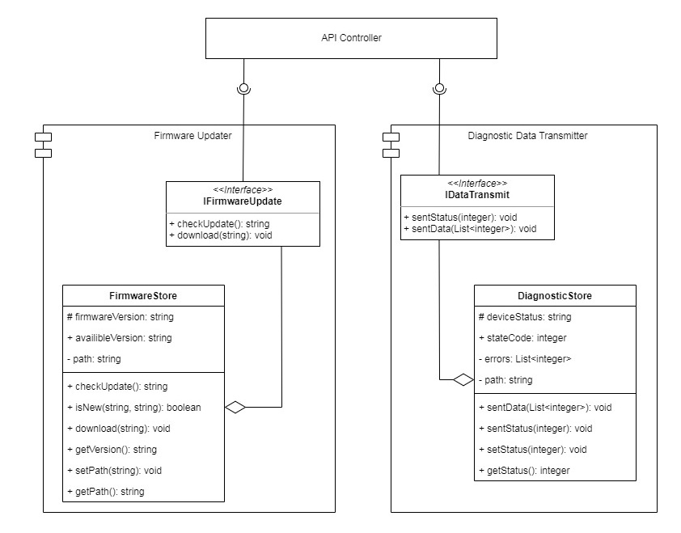
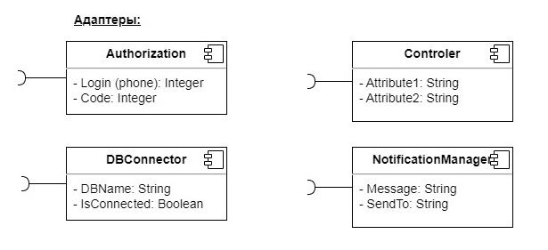
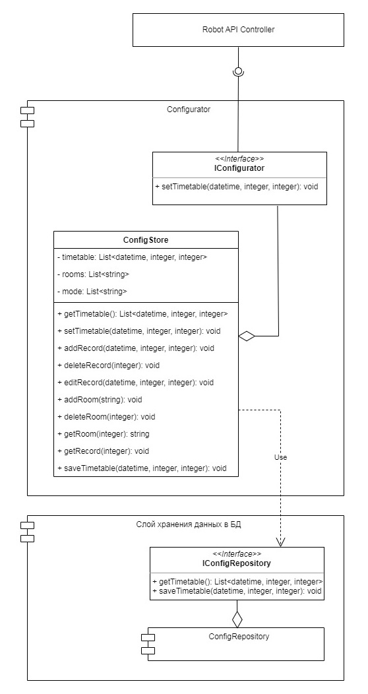
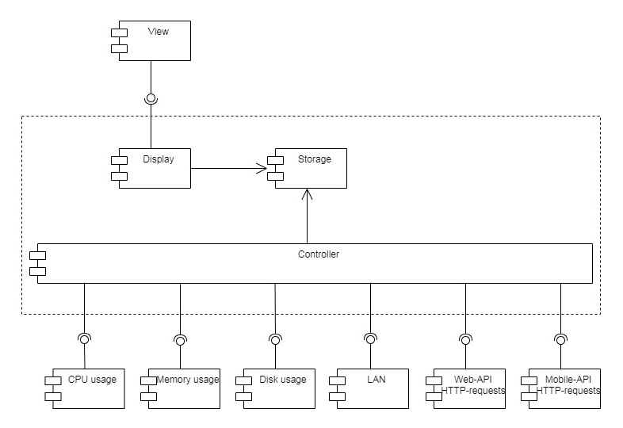

# `Домашнее задание 11`

## `Задача:`

Необходимо спроектировать облачный сервис домашнего робота пылесоса для уборки помещений (продолжение задания из ДЗ-10).

8. Спроектировать компонент подключения по API к производителю роботов-пылесосов, для обновления прошивок и передачи диагностических данных https://app.diagrams.net/.

9. Спроектировать адаптеры интерфейсов в виде компонент (подключение к БД, шлюзы к интерфейсу, шлюзы к третьим источникам) https://app.diagrams.net/.

10. Спроектировать компонент внешнего конфигурирования для настройки компонент бизнес-логики (параметры конкретного робота) https://app.diagrams.net/.

11. Спроектировать и имплементировать компонент самодиагностики (Self-checking). Который собирает статус работоспоспособности и времени запроса на каждый компонент уровня API Gateway, бизнес-логики и слоя управления данными. Включая технологический интерфейс для мониторинга https://grafana.com/ или https://prometheus.io/ .

12. Выбрать метрики для наблюдения за инфраструктурой, на которой будет развёрнуто решение (процессор, память, диск).

## `Описание решения:`

8. UML-диаграмма компонента подключения по API к производителю роботов-пылесосов для обновления прошивок и передачи диагностических данных представлена ниже:
UML-диаграмма компонентов представлена на схеме:

9. UML-диаграмма адаптеров интерфейсов в виде компонент (подключение к БД, шлюзы к интерфейсу, шлюзы к третьим источникам) представлена ниже:
UML-диаграмма компонентов представлена на схеме:

10. UML-диаграмма компонента внешнего конфигурирования для настройки компонент бизнес-логики (параметры конкретного робота) представлена ниже:

11. UML-диаграмма компонента самодиагностики (Self-checking), собирающего информацию о статусе работоспоспособности и времени запроса на каждый компонент уровня API Gateway, бизнес-логики и слоя управления данными, представлен ниже:

12. Основные метрики для наблюдения за инфраструктурой, на которой будет развёрнуто решение (процессор, память, диск), и оценки производительности:

* Потребление ресурсов центрального процессора (CPU, %) - сколько времени из заданного определённого интервала было потрачено процессором на вычисления для выбранного процесса.

* Потребление оперативной памяти (Memory usage, Mb)

* Потребление сетевых ресурсов

* Работа с дисковой подсистемой (I/O Wait), сбор статистики по работе с диском.

* Время выполнения запроса (request response time, ms) на серверной стороне

* «Болтливость» в сети (chattiness) - частота HTTP-запросов (API-вызовов), необходимых для выполнения бизнес-операции, направленных в короткий промежуток времени одним и тем же клиентом (может указывать на необходимость оптимизации системы путем объединения этих запросов в один или несколько). 

* Сетевые оверхеды и расположение клиентов (в зависимости от места расположения клиента и/или робота-пылесоса, подключаем его к ближайшему серверу для уменьшения сетевых задержек. 