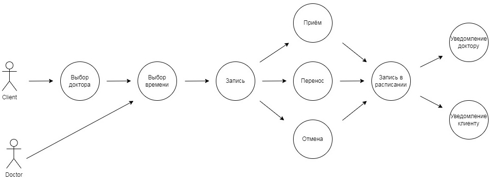
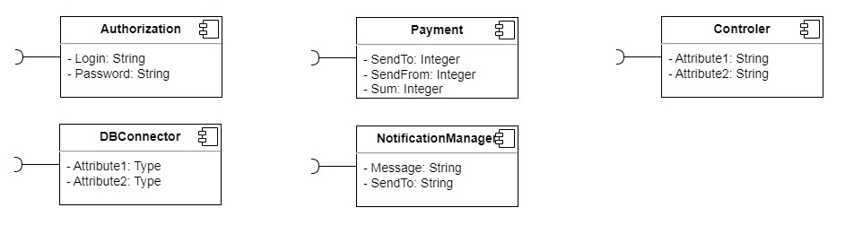
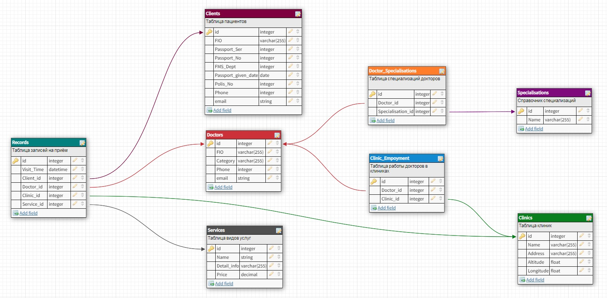

# `Домашнее задание 6`

## `Задача:`

Необходимо спроектировать сервис записи на приём к доктору.

а. Доменная модель (клиника, пациент, доктор, вид услуги, расписание, ..), в виде текста. Домен – атрибуты.

б. Сценарии (выбор доктора, выбор времени, запись, перенос, отмена, приём, ..), в виде Актор – Прецедент (из первой лекции).

с. Адаптеры интерфейсов в виде компонент (подключение к БД, шлюзы к интерфейсу, шлюзы к третьим источникам)

Разработать полную ERD домена в https://www.dbdesigner.net

## `Описание решения:`

1. Доменная модель включает в себя следующие сущности и их атрибуты:
  * Клиника (название, адрес, координаты клиники) 
  * Пациент (ФИО, серия и номер паспорта, кем выдан, дата выдачи паспорта, номер полиса, телефон, email)
  * Доктор (ФИО, специализация, категория, телефон, email)
  * Вид услуги (название, описание, цена)
  * Расписание (дата и время приёма, пациент, доктор, клиника, вид услуги)

2. Сценарии использования (выбор доктора, выбор времени, запись, перенос, отмена, приём, ..) в виде Актор – Прецедент представлены на Use-Case диаграмме ниже:
 

3. Адаптеры интерфейсов в виде компонент (подключение к БД, шлюзы к интерфейсу, шлюзы к третьим источникам) представлены на изображении ниже:

4. ERD-модель домена представлена ниже:

