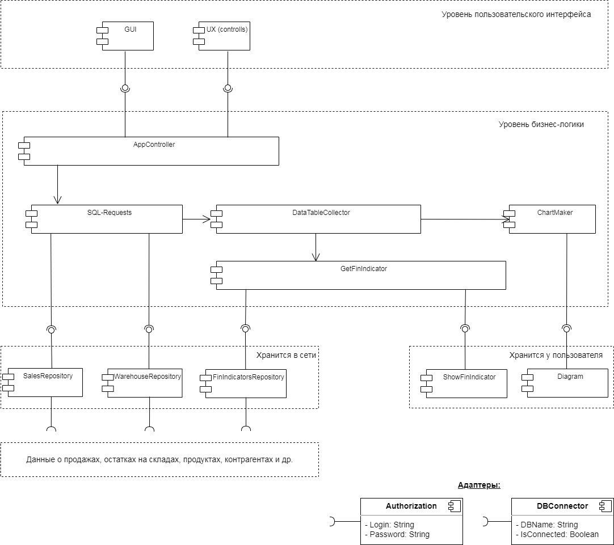
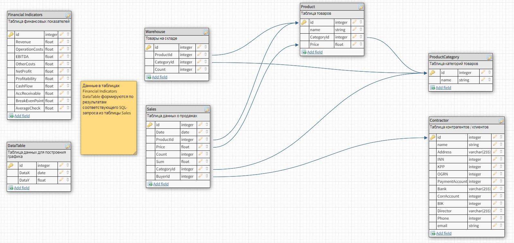

# `Домашнее задание 7`

## `Задача:`

Необходимо спроектировать сервис отчётов для компании оптовой торговли.

а. Доменная модель (компания, товарные категории, табличный отчёт, графики и диаграммы, финансовые показатели, ..), в виде текста Домен – атрибуты.

б. Экранные формы (выбор товарных категорий, формы отчётов), компоненты интерфейса (поля, кнопки, чек-боксы, ..), инструмент https://www.figma.com/ или https://app.diagrams.net/

с. Определить тип подходящей для этого контента архитектуры ( SPA CSR, SSR).

d. Сформировать компоненты бизнес-логики (функциональные) необходимые для построения этих отчётов. Показать связь между компонентами интерфейса и компонентами бизнес-логики. На диаграмме или текстовым описанием.

## `Описание решения:`

1. Доменная модель включает в себя следующие сущности и их атрибуты:
  * Компания-клиент (название, юр.адрес, ИНН, КПП, ОГРН, рассчетный счет, банк, корр. счет, БИК, ФИО директора, телефон, email) 
  * Товарные категории (наименование товара, категория товара)
  * Таблица данных о продажах для формирования графика (дата, товар, товарная категория, кол-во, сумма, контрагент)
  * Таблица данных об остатках товаров на складе (товар, товарная категория, количество)
  * Табличный отчет - срез данных таблицы продаж (данные по оси Х, данные по оси Y)
  * Графики и диаграммы (наименование, дата составления, график/диаграмма)
  * Финансовые показатели (дата отчёта, выручка, операционные расходы, EBITDA, прочие расходы, чистая прибыль, рентабельность, денежный поток, дебиторская задолженность, точка безубыточности, средний чек)
  * Также можно включить хранимые SQL-запросы для формирования данных из таблицы продаж и построения на основе результатов запроса соответсвующих графиков/диаграмм 

2. Экранные формы (выбор товарных категорий, формы отчётов), компоненты интерфейса (поля, кнопки, чек-боксы, ..) представлены ниже:
 

3. Тип подходящей для этого контента архитектуры - CSR - сервер направляет данные, сгенерированные по результатам запроса клиента. На стороне клиента на основе полученных данных формируется графическое отображение. При этом на сервере логика будет одна и та же, а клиентская часть может быть в виде десктопного приложения для бухгалтерии (полноценная версия приложения для формирования отчетов) и в виде веб-приложения для руководителя (более простая версия с основными финансовыми показателями).

4. Компоненты бизнес-логики (функциональные) необходимые для построения сервиса отчётов и ERD-модель домена представлены ниже:

UML-диаграмма компонент

ERD-модель домена

