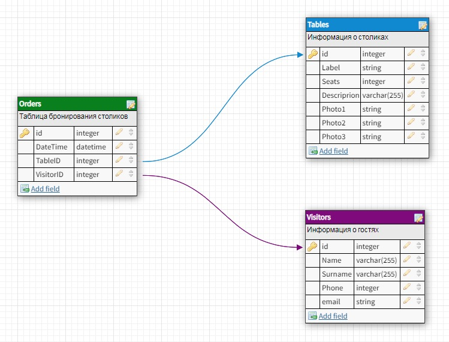
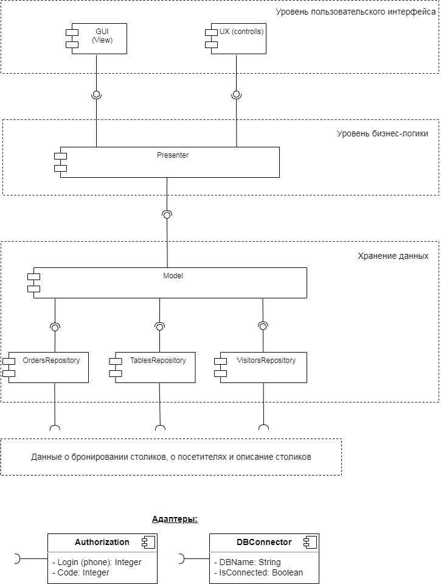

# `Домашнее задание 8`

## `Задача:`

Необходимо спроектировать сервис бронирования столика в ресторане. C полями ввода данных о пользователе и заказе, возможностью выбора столика и с кнопкой подтверждения заказа.

а. Доменная модель, в виде текста Домен – атрибуты.

b. Экранные формы, компоненты интерфейса (поля, кнопки, чек-боксы, ..), инструмент [https://www.figma.com/](https://www.figma.com/) или [https://app.diagrams.net/](https://app.diagrams.net/)

с. Разработать полную ERD домена в https://www.dbdesigner.net/.

d. Разработать диаграмму компонент в UML

e. Задание со *: сделать прототип сервера по UML диаграмме на JAVA.

## `Описание решения:`

1. Доменная модель включает в себя следующие сущности и их атрибуты:
  * Гости ресторана (имя, фамилия, телефон, email) 
  * Информация о столиках (обозначение столика для персонала, вместимость, описание, фотографии)
  * Таблица бронирования столиков (дата и время брони, какой столик забронирован, кем забронирован)

2. Экранные формы (выбор товарных категорий, формы отчётов), компоненты интерфейса (поля, кнопки, чек-боксы, ..) разработаны в Figma и представлены по ссылке:

https://www.figma.com/file/vZvL05CATI02rxf87jqSfH/TableBooking?node-id=0%3A1&t=aHlu3WR6OFvQFwCB-1

3. ERD-модель домена представлена на диаграмме ниже:

4. Компоненты бизнес-логики (функциональные), необходимые для построения бронирования столика в ресторане, представлены ниже:

С учётом того, что ресурс (бронирование свободных столиков) будет использоваться совместно несколькими пользователями, необходимо не доспускать ситуаций, когда один столик одновременно бронируют несколько человек. При бронировании столика меняется модель (информация о свободных столиках) и это нужно контролировать. Для реализации такой модели наиболее подходит архитектура приложения MVP. 

UML-диаграмма компонент

**`Model`** - отвечает за работу с данными: запрос, сохранение или изменение данных в БД или файлах.

**`Презентер`** реализует основную бизнес-логику и содержит следующие методы:

**loadTabels** - получение списка всех столиков со статусом (свободно, забронировано);

**bookTable** – бронирование столика;

**changeTable** – поменять бронь столика.

Presenter вызывает эти методы, но он не знает как эти методы реализованы в Model

**`View`** - отвечает за отображение данных на экране (UI) и за обработку действий пользователя (UX) и содержит следующие методы, вызываемые презентером:

**showTables** - отображение списка столиков;

**getUserInfo** – сбор данных о пользователе и бронировании столика (имя, номер телефона, время, количество персон)

Шаги взаимодействия **View**, **Presenter** и **Model**:

1. **Presenter** просит **Model** дать ему данные из БД о занятости столиков.
2. **Presenter** просит **View** показать данные о столиках.
3. Пользователь выбирает подходящий столик и вводит свои данные в поля ввода. Это не обрабатывается и ничего не происходит.
4. Пользователь жмет кнопку «подтверждения заказа».
5. **View** сообщает **Presenter** о том, что была нажата кнопка «подтверждения заказа».
6. **Presenter** просит **View** дать ему данные, которые были введены пользователем в поля ввода.
7. **Presenter** проверяет эти данные на корректность.
8. Если они некорректны, то **Presenter** просит представление показать сообщение об этом.
9. Если данные корректны, то **Presenter** просит представление показать прогресс-бар и просит **Model** добавить данные в базу данных.
10. **Model** выполняет вставку данных и сообщает **Presenter**, что вставка завершена.
11. **Presenter** просит представление убрать прогресс-бар.
12. **Presenter** запрашивает данные о подтверждении бронирования у **Model**.
13. **Model** возвращает данные **Presenter**.
14. **Presenter** просит **View** показать новые данные.
15. **Presenter** управляет всем происходящим. Он указывает **View** и **Model**, что делать и как реагировать на действия пользователя.
