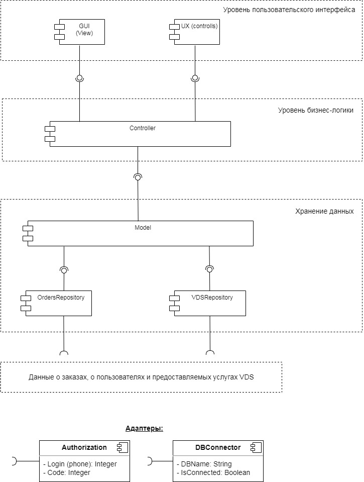

# `Домашнее задание 9`

## `Задача:`

Необходимо спроектировать контракт API для приложения заказа (создания) ресурсов в облачном сервисе (CPU, RAM, IP, OS).

1. Доменная модель, в виде текста Домен – атрибуты.

2. Сформировать REST запросы: GET, POST, PUT, DELETE. Компонент бизнес-логики проводит CRUD операции с БД, инструмент проектирования API контракта [https://swagger.io](https://swagger.io).

3. Определить и передавать параметры в формате JSON (тип ресурса – хранилище или компьютер, процессор, ОЗУ, диск – объём и тип, операционная система, IP адрес).

4. Сгенерировавать (автоматически на ресурсе [https://swagger.io](https://swagger.io) код на разных языках программирования.

5. Разработать экранные формы интерфейса для заказа ресурсов в облачном сервисе в [https://www.figma.com/](https://www.figma.com/) или [https://app.diagrams.net/](https://app.diagrams.net/).

6. Разработать полную ERD домена в [https://www.dbdesigner.net/](https://www.dbdesigner.net/).

7. Дополнить swagger ответами домена (сутевые ответы) о статусе заказа ресурсов (создан, ошибка, нет ответа) и смоделировать ошибки REST «400, 500» типов.

8. Имплементировать сгенерированный swagger код в приложения студента.

## `Описание решения:`

1. Доменная модель включает в себя следующие сущности и их атрибуты:
  * Информация о заказах (номер заказа, дата заказа, пользователь, спецификация VDS, сколько месяцев оплачено, когда заканчивается аренда VDS) 
  * Информация о пользователях (email, телефон, средств на счету)
  * Таблица спецификаций VDS (OS, CPU, RAM, Disk, IP-address, итоговая цена)
  * Таблица операционных систем (група ОС, версия ОС, цена)
  * Таблица процессоров (название процессора, число ядер, частота, цена)
  * Таблица вариантов оперативной памяти (количество ГБ, цена)
  * Таблица вариантов диска (тип диска, емкость, цена)
  * Таблица вариантов IP (тип IP-адреса, цена, количество адресов)

2. С помощью инструмента  ресурса https://editor.swagger.io сформированы REST запросы: GET, POST, PUT, DELETE при выполнении операций бизнес-логики (CRUD операции с БД).

3. В формате JSON передаются следующие параметры

* при регистрации нового аккаунта (имя пользователя, email, телефон)
* при создании нового заказа (тип ОС, версия ОС, тип процессора, число ядер, частота процессора, объем RAM, тип диска, объём диска, тип IP адреса, количество IP адресов, количество месяцев аренды).

4. С помощью ресурса [https://swagger.io](https://swagger.io) сгенерирован код на языке Java.

5. Экранные формы интерфейса для заказа ресурсов в облачном сервисе разработаны в Figma и представлены по ссылке:

[Экранные формы интерфейса в Figma](https://www.figma.com/file/3kenGYrVQpmI7kBkHTzV9O/VDS_service?node-id=0%3A1&t=sQvVWU3VQIUlqnT1-1)

6. ERD-модель домена представлена на диаграмме ниже:

UML-диаграмма компонентов представлена на схеме:

7. Дополнить swagger ответами домена (сутевые ответы) о статусе заказа ресурсов (создан, ошибка, нет ответа) и смоделировать ошибки REST «400, 500» типов.

8. Имплементировать сгенерированный swagger код в приложения студента.
