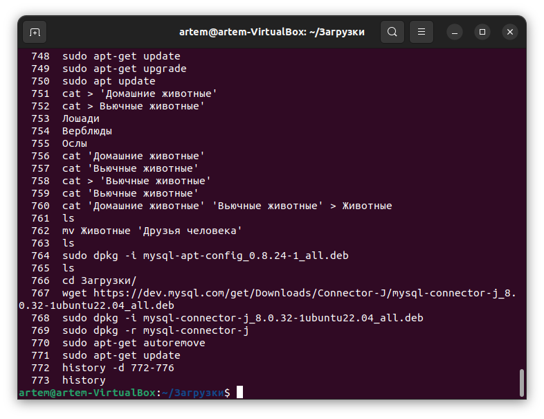

# `Итоговая аттестация. Практическое задание`

## `Информация о проекте`
Необходимо организовать систему учета для питомника, в котором живут домашние и вьючные животные.

## `Задание:`

1. Используя команду cat, в терминале операционной системы Linux создать два файла Домашние животные (заполнив файл собаками, кошками, хомяками) и Вьючные животными (заполнив файл лошадьми, верблюдами и ослами), а затем объединить их. Просмотреть содержимое созданного файла. Переименовать файл, дав ему новое имя (Друзья человека).

cat > 'Домашние животные'

В открывшемся файле указываем
Собаки
Кошки
Хомяки

cat > 'Вьючные животные'

В открывшемся файле указываем
Лошади
Верблюды
Ослы

cat 'Домашние животные' 'Вьючные животные' > Животные

ls

mv Животные 'Друзья человека'

ls

2. Создать директорию, переместить файл туда.

mkdir animals

mv 'Друзья человека' animals/

ls

3. Подключить дополнительный репозиторий MySQL. Установить любой пакет из этого репозитория.

Скачиваем конфигуратор mysql:

wget https://dev.mysql.com/get/mysql-apt-config_0.8.24-1_all.deb

Переходим в папку Загрузки и устанавливаем компоненты mysql с помощью конфигуратора:

cd Загрузки
sudo dpkg -i mysql-apt-config_0.8.24-1_all.deb

В процессе установки жмем Ок, чтобы выполнить полную установку

Обновляем информацию о пакетах и видим подключенный репозиторий mysql:

sudo apt-get update

Устанавливаем mysql-server:

sudo apt-get install mysql-server

Проверяем результат установки:

systemctl status mysql

4. Установить и удалить deb-пакет с помощью dpkg.

Скачиваем пакет для установки:

wget https://dev.mysql.com/get/Downloads/Connector-J/mysql-connector-j_8.0.32-1ubuntu22.04_all.deb

Устанавливаем пакет mysql-connector-j_8.0.32-1ubuntu22.04_all.deb:

sudo dpkg - i ~/Загрузки/mysql-connector-j_8.0.32-1ubuntu22.04_all.deb

Удаляем пакет и его сопутствующие пакеты:

sudo dpkg -r mysql-connector-j

sudo apt-get autoremove 

5. Выложить историю команд в терминале ubuntu.

Для получения истории введенных команд в терминале ubuntu используем:

history

Скриншот введенных команд представлен ниже

6. Нарисовать диаграмму, в которой есть класс родительский класс, домашние животные и вьючные животные, в составы которых в случае домашних животных войдут классы: собаки, кошки, хомяки, а в класс вьючные животные войдут: лошади, верблюды и ослы).

7. В подключенном MySQL репозитории создать базу данных "Друзья человека"

8. Создать таблицы с иерархией из диаграммы в БД.

9. Заполнить низкоуровневые таблицы именами (животных), командами, которые они выполняют, и датами рождения.

10. Удалив из таблицы верблюдов, т.к. верблюдов решили перевезти в другой питомник на зимовку, объединить таблицы лошади и ослы в одну таблицу.

11. Создать новую таблицу “молодые животные”, в которую попадут все животные старше 1 года, но младше 3 лет и в отдельном столбце с точностью до месяца подсчитать возраст животных в новой таблице.

12. Объединить все таблицы в одну, при этом сохраняя поля, указывающие на прошлую принадлежность к старым таблицам.

13. Создать класс с Инкапсуляцией методов и наследованием по диаграмме.

14. Написать программу, имитирующую работу реестра домашних животных.
В программе должен быть реализован следующий функционал:

    14.1. Завести новое животное

    14.2. Определять животное в правильный класс
    
    14.3. Увидеть список команд, которое выполняет животное
    
    14.4. Обучить животное новым командам
    
    14.5. Реализовать навигацию по меню

15. Создайте класс Счетчик, у которого есть метод add(), увеличивающий значение внутренней int переменной на 1 при нажатии "Завести новое животное". Сделайте так, чтобы с объектом такого типа можно было работать в блоке try-with-resources. Нужно бросить исключение, если работа с объектом типа счетчик была не в ресурсном try и/или ресурс остался открыт. Значение считать в ресурсе try, если при заведении животного заполнены все поля.
