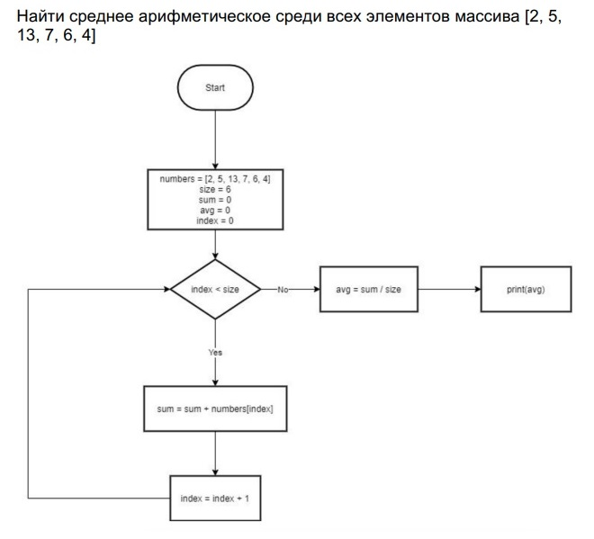
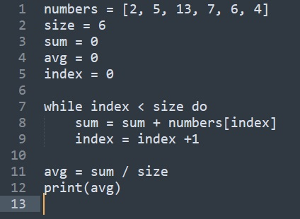
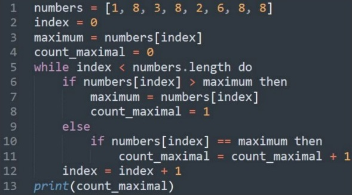
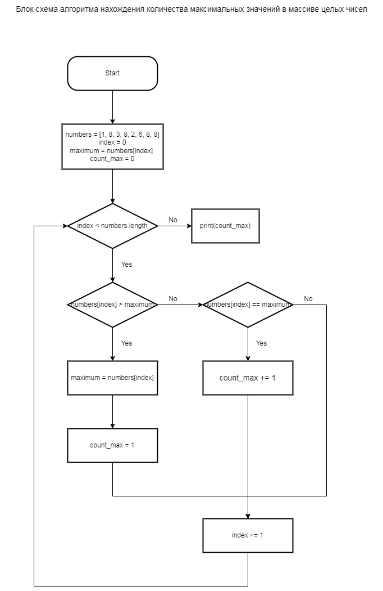

# `Домашнее задание`

## `Задача 1:`
Написать псевдокод по блок-схеме:

## `Решение:`
Псевдокод для решения задачи 1 приведен ниже: 

## `Задача 2:`
Составить блок-схему на основе псевдокода:

## `Решение:`
Блок-схема на основе исходного псевдокода составлена с использованием ресурса https://www.draw.io и приведена ниже: 

